# Tripella app 
## Overview
Imagine that you want to travel to a city with a group of friends, but you do not know the best places in it, we designed a website that helps you find many places in the city you want to travel to, and you can then add it to your schedule on the trip, share it with your friends, share your opinion, add your favorite places, your rating, and other things.
## User Story 
[user story](ReadMe/UserStory.md)
## Technologies Used
* React
* HTML
* JavaScript
* CSS 
* w3-School
* React-bootstrap
* shared hosting

## Back-End 
 [Link to Back-End](https://git.generalassemb.ly/arelyas/Tripella_BackEnd)
## Link 
[Tripella](http://tripella.net/home)
## Images
### Wireframes
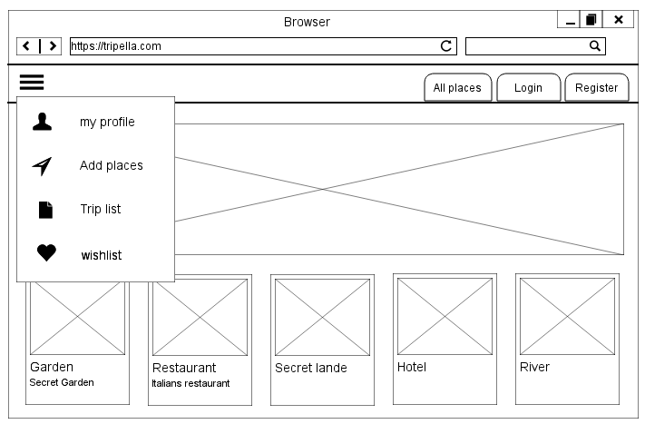
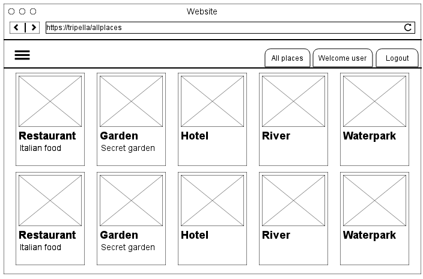
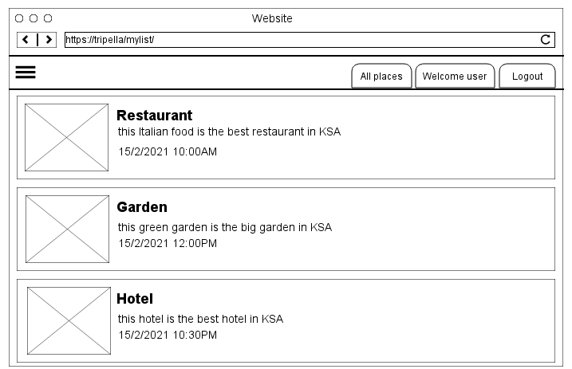
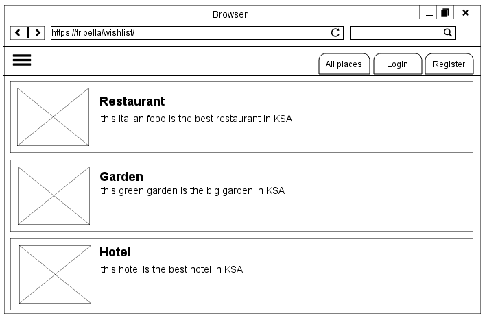
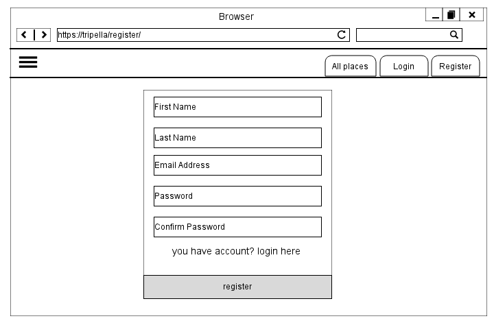
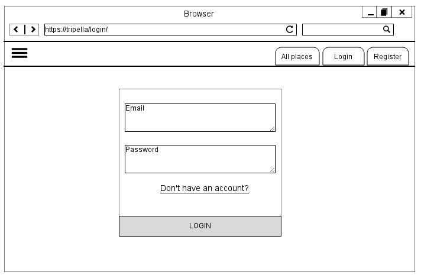
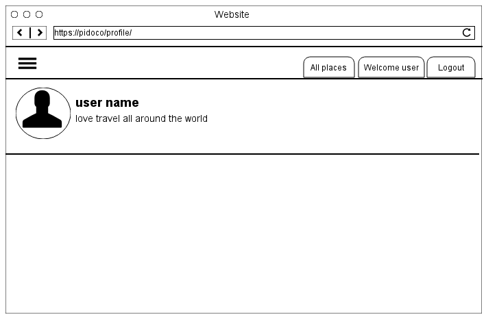
### Screenshot
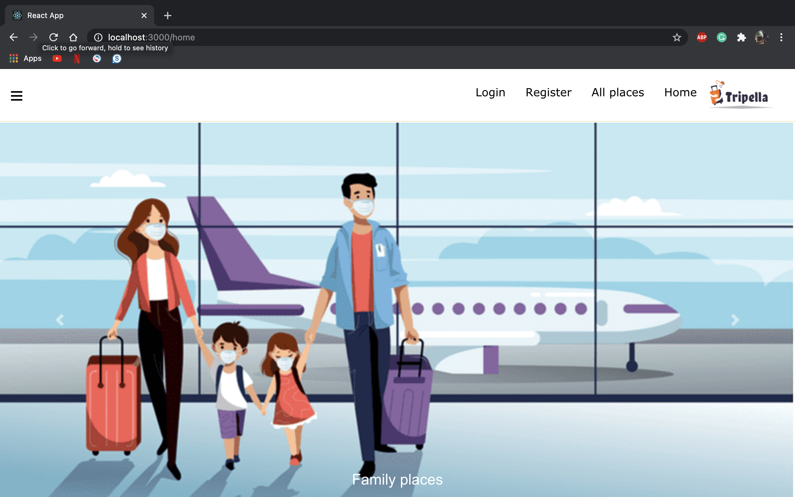
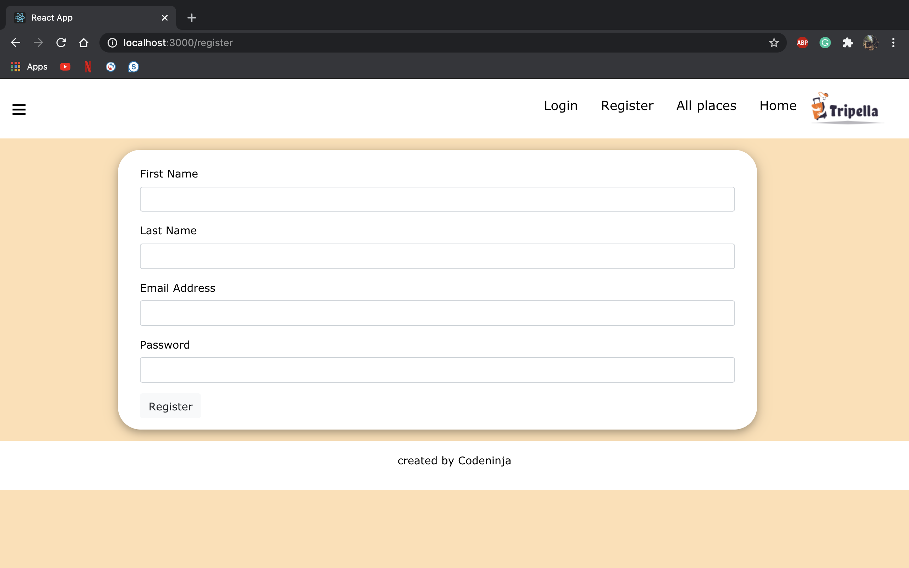
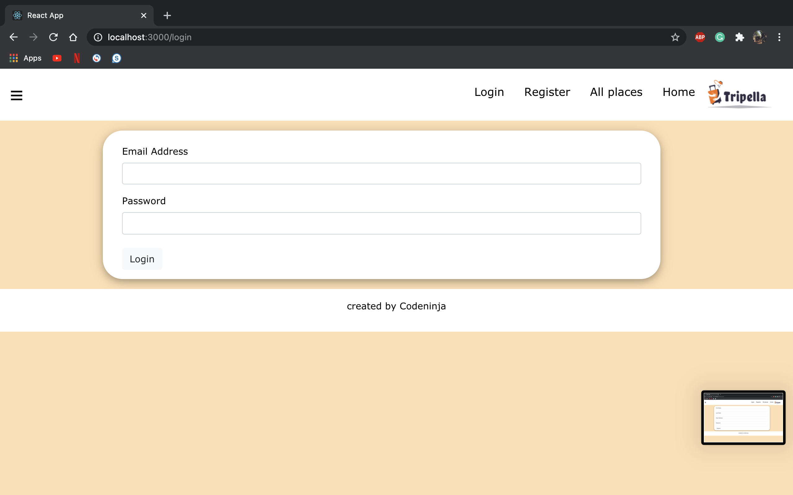
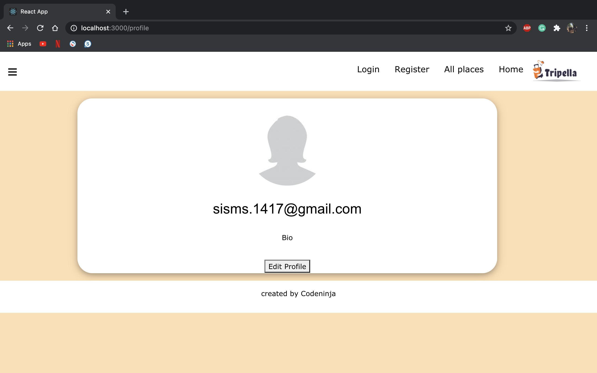
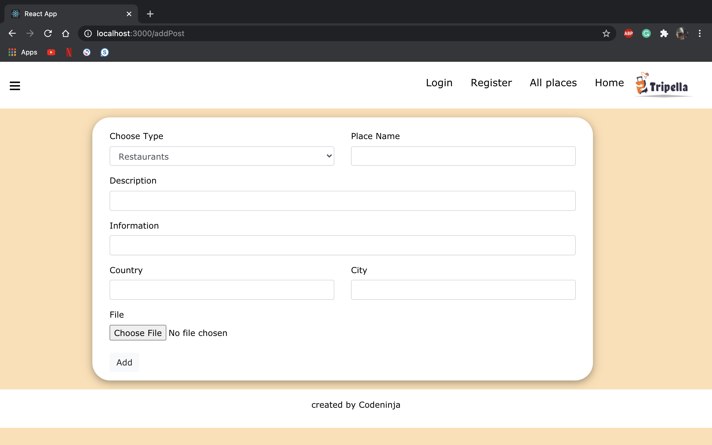
